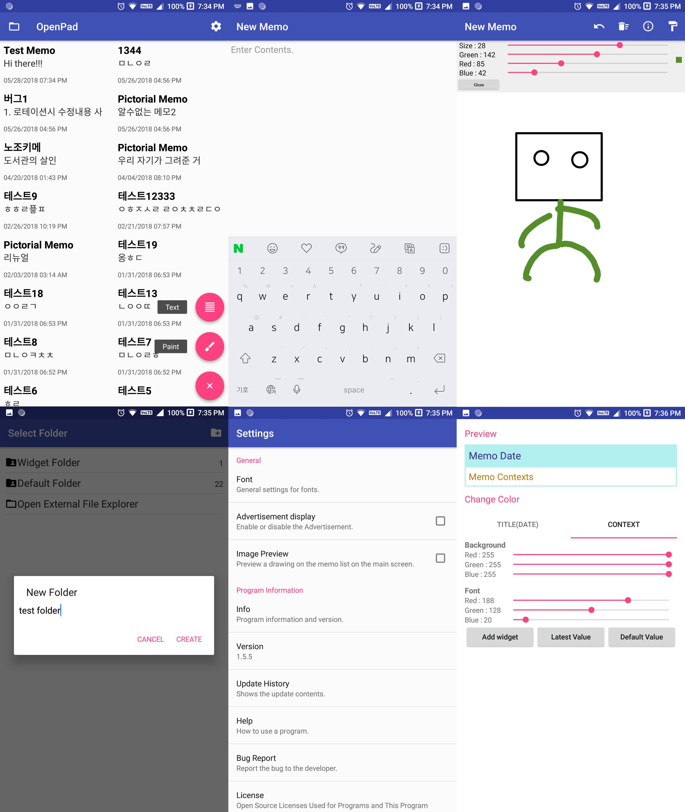

# OpenPad for Android
[](https://android-arsenal.com/api?level=15)[](http://www.apache.org/licenses/LICENSE-2.0)

## Download
[Google Play](https://play.google.com/store/apps/details?id=com.eskeptor.openTextViewer)

[Github](/Apk)
## Features
```
 1) Low memory(Very light)
 2) There is no need for Internet connection.(but no sync function.)
 3) Text Viewer function(using embedded file explorer)
```
## What's New? (Last updated 2018.6.8) - None Build
```
 1) Add Encrypt key file backup
 2) Add Encrypt file function
 3) Add tools - OpenPad Decrypt Tool (Java Program for PC)
```
## Lasted Update List
[View Lists](./UPDATE.md)
## Known Bugs
```
 1) Shape Tools in Paint Mode has Trailing Effect When Resizing
```
## OpenPad Decrypt Tool
[Go to OpenPad Decrypt Tool](./openpadcrypt)
```
 It's program to recover files encrypted with OpenPad.
 (Need "Key file (Settings - Security - Extract key file")
```
## Development environment
#### 1st environment
```
 Operating System : Windows 10 Pro RS4 64bit
 CPU : AMD Ryzen R5 1600
 RAM : 24GB
 VGA : Nvidia Geforce GTX 1050 2GB
 Android SDK(Min) : API 15
 Android SDK(Target and Compiled) : API 27
```
#### 2nd environment
```
 Operating System : Ubuntu 16.04 LTS 64bit
 CPU : Intel Core i5-8250U
 RAM : 8GB
 VGA : Intel UHD Graphics 620
 Android SDK(Min) : API 15
 Android SDK(Target and Compiled) : API 27
```
## License
Copyright 2017 Jeon Ye-Chan

Licensed under the Apache License, Version 2.0 (the "License");
you may not use this file except in compliance with the License.
You may obtain a copy of the License at
```
http://www.apache.org/licenses/LICENSE-2.0
```
Unless required by applicable law or agreed to in writing, software
distributed under the License is distributed on an "AS IS" BASIS,
WITHOUT WARRANTIES OR CONDITIONS OF ANY KIND, either express or implied.
See the License for the specific language governing permissions and
limitations under the License.
## Good Bye!!
Compiled by Android Studio 3.1.2
